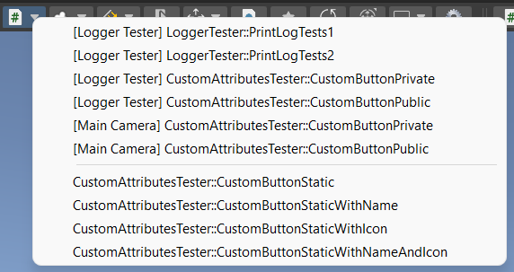
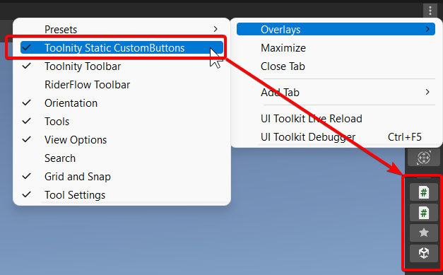
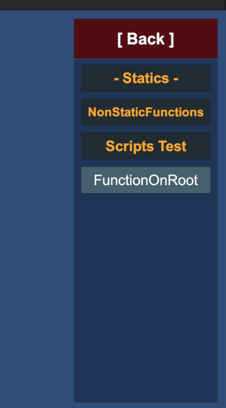

# Toolnity Custom Buttons

## Information

* Use the `[CustomButton]` attribute in a method to have a shortcut in the **Toolnity Toolbar**

 

* Use `[CustomButton]` attribute in an static method to have a button in the **Toolnity Static CustomButtons Toolbar**

  

* Attach the component `Custom Button Runtime Context` to show the methods marked as Custom Buttons in the current Game Object.

  

--------------------------------

## Support
This is an Open Source project that I'm developing in my spare time.
You can use it as you want or contact with me for any feedback, suggestion or just hey Hi!

If you want to contribute, you can do it with Pull Requests or supporting me as a Sponsor in GitHub to keep working on that:
[https://github.com/sponsors/DTeruel](https://github.com/sponsors/DTeruel)

# Thank you!
