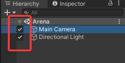

# Toolnity Hierarchy Window Extensions

## Information
  
#### Hierarchy Object Active
* Enable and disable objects easily from the Hierarchy Window

  

#### Hierarchy Colorizer
* Add color to any game object in the Hierarchy View to organize your scene

  

--------------------------------

## Support
This is an Open Source project that I'm developing in my spare time.
You can use it as you want or contact with me for any feedback, suggestion or just say Hi!

If you want to contribute, you can do it with Pull Requests or supporting me as a Sponsor in GitHub to keep working on that:
[https://github.com/sponsors/DTeruel](https://github.com/sponsors/DTeruel)

# Thank you!
