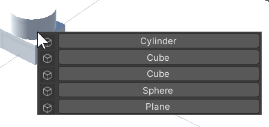

# Toolnity Shortcuts

## Information

#### Camera Shortcuts
* F1: Toggle Camera in Top/Bottom View
* F2: Toggle Camera in Left/Right View
* F3: Toggle Camera in Front/Back View
* F4: Toggle Camera in Perspective/Orthographic View

#### General Shortcuts
* F5: Play/Stop
* F6: Pause/Resume
* F12: Shortcut to save all your Scenes opened and Project
* Press Alt + double click in the Hierarchy Window to create a new GameObject
  
#### Teleport Game Object
* Teleport the selected game object to the mouse position in the Scene View, when you press Left Shit + T

#### Game Object Selector
* Multiple GameObject selector in your Scene View using Left Ctrl + Left Shift + Left Click

  

--------------------------------

## Support
This is an Open Source project that I'm developing in my spare time.
You can use it as you want or contact with me for any feedback, suggestion or just say Hi!

If you want to contribute, you can do it with Pull Requests or supporting me as a Sponsor in GitHub to keep working on that:
[https://github.com/sponsors/DTeruel](https://github.com/sponsors/DTeruel)

# Thank you!
