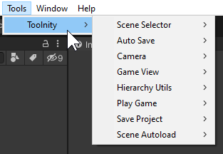
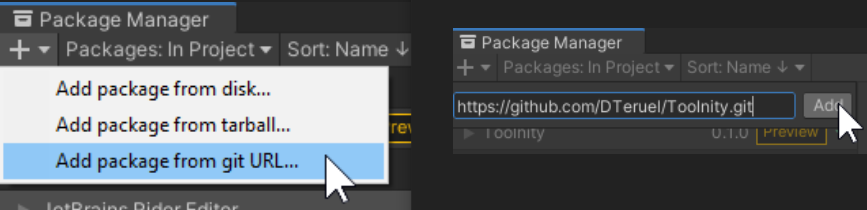
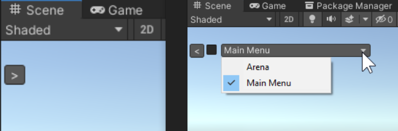
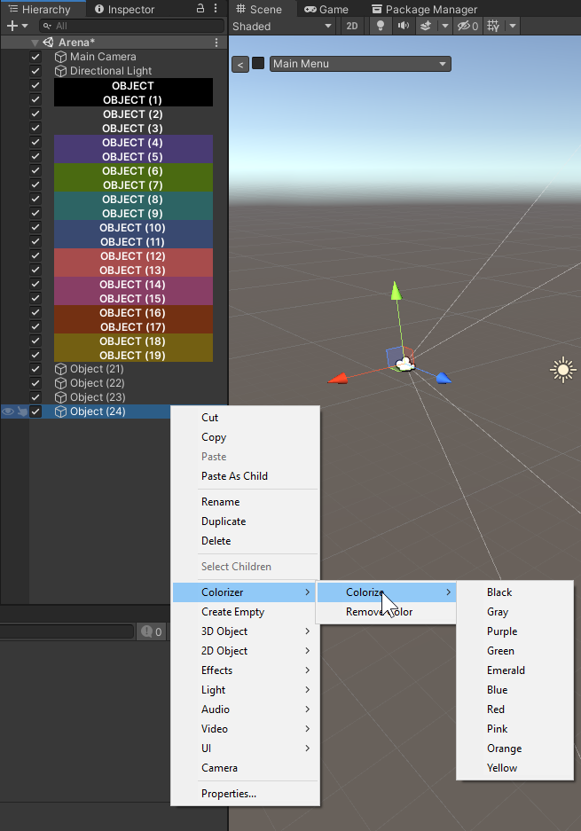
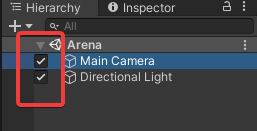
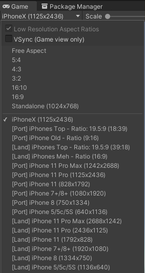

# Toolnity

**Toolnity** is a bunch of Editor Tools and Gameplay Utilities for Unity.

The repository is ready to be used directly in Unity without the need to download it. You can add it to your project using the Repo-URL in the Project Manager.

The big part of the content is made from scratch, but some classes are from other authors or are inspired from other authors (in these cases, you will find the link inside the source)

--------------------------------
## Editor Tools

  #### Auto Save
   * Save the Scene and the Project everytime you run the game

   * You can disable this option in "Tools/Toolnity/Auto Save"

  #### Save Project
   * F12: Shortcut to save all your Scenes opened and Project

  #### Scene Selector
   * Adds small button in the Scene View to open easily any scene on your project
   

  #### Hierarchy Colorizer
   * Add color to any game object in the Hierarchy View
   

  #### Hierarchy Object Active
   * Enable and Disable objects easily direct from the Hierarchy View
   

  #### Camera Shorcuts
   * F1: Toggle Camera in Top/Bottom View
   * F2: Toggle Camera in Left/Right View
   * F3: Toggle Camera in Front/Back View
   * F4: Toggle Camera in Perspective/Orthographic View

  #### Game View Resolution
   * Add different mobile resolutions and aspect rations to your Game View
   

  #### Play Game
   * F5: Play / Stop
   * F6: Pause / Resume
   * F7: Next Frame 

  #### Scene Auto Loader
   * Option to run from an specific Scene everytime you press Play

--------------------------------
## Gameplay Utilities

  #### Autos
   * Scripts to perform easy actions (Bounce Object, Color Changer, Scale Anim, ...)

  #### Game Events
   * GameEvent: Scriptable object to raise custom events
   * GameEventListener: Script to assign Unity Events as callbacks when the previous events are raised

  #### Any Button Event
   * Trigger Unity Events when any button/key is pressed

  #### Don't Destroy
   * Mark this object as a Don't Destroy Object automatically

  #### Event Sequencer
   * Trigger Unity Events in sequence with Delay Timers

  #### Fader
   * Create simple Fade transitions

  #### Input Event Launcher
   * Trigger UnityEvents when an specific button/key is pressed

  #### Load Scene
   * Script to load an specific scene on a call

  #### Quit Game
   * Exit the game when press Esc

  #### Scene Change Event
   * Trigger Unity Events when an Scene has been loaded

  #### Singleton
   * Set as Singleton any of your classes

--------------------------------
## Support
This is an Open Source project that I'm developing in my spare time. You can use it as you want or contact with me for any feedback or suggestion.
You can contribute supporting me as a Sponsor in GitHub to keep working on more and better Tools and Features for Unity.

[https://github.com/sponsors/DTeruel](https://github.com/sponsors/DTeruel)

Thank you!
