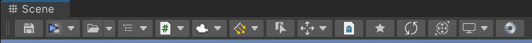

# Toolnity

## Information
**Toolnity** is a bunch of Editor Tools and Gameplay Utilities for Unity.

* You can find the most of the utilities in the Unity Menus:

* You can add the **Toolnity Toolbar** and **Toolnity Static CustomButtons Toolbar** in your Scene view using the overlays

--------------------------------

## How to install it?
The repository is ready to be used directly in Unity without the need to download it. 
You can add it to your project using the git URL in the Package Manager.

You can use also OpenUPM to link **Toolnity** by version (**recommended**).

 *The big part of the content is made from scratch, but some classes are from other authors or are inspired from other authors (in these cases, you will find the link inside the source)* 

--------------------------------

## Editor Tools
You can enable and disable the most of the editor tools in your project settings:

 

Remember to check the Context Menu in your Project Window to create **Toolnity** objects:

### These are the tools available in the Editor:

#### Auto Save
* Save the Scene and the Project everytime you run the game

#### Scene Auto Loader
* Open and run an specific Scene everytime you press Play

#### Editor Shortcuts
* F5: Play/Stop
* F6: Pause/Resume
* F7: Next Step
* F12: Shortcut to save all your Scenes opened and Project
* Double click in the Hierarchy Window to create a new GameObject
  
#### Camera Shortcuts
* F1: Toggle Camera in Top/Bottom View
* F2: Toggle Camera in Left/Right View
* F3: Toggle Camera in Front/Back View
* F4: Toggle Camera in Perspective/Orthographic View
  
#### Hierarchy Object Active
* Enable and Disable objects easily direct from the Hierarchy View

  

#### Hierarchy Colorizer
* Add color to any game object in the Hierarchy View to organize your scene

  

#### Game Object Selector
* Multiple GameObject selector in your Scene View using LeftCtrl+LeftShift+LeftMouseClick

    
  
#### Scene Selector
* Quick access to open any scene on your project

#### ToDo List
* Utility to track your tasks

    

#### CustomButton Attribute
* Use `[CustomButton]` attribute in a method to have a shortcut in the **Toolnity Toolbar**

  

* Use `[CustomButton]` attribute in an static method to have a button in the **Toolnity Static CustomButtons Toolbar**

  

#### Lightning Utilities
* Different utilities related with the lightning on your scene

  
  
#### Interesting Game Objects
* InterestingGameObject component is an script that you can add to any game object and with Shift+N or using the Toolbar you can access to them quickly

#### Teleport Game Object
* Teleport the selected game object to the mouse position in the Scene View, when you press LeftShit+T

#### Find Missing Scripts
* Utility to find missing scripts in all the game objects selected

#### Favorites
* Window to have bookmarks of any object in your project

  

#### Replace Tool
* Tool to replace all objects selected by a Prefab

  

#### Transform Randomizer
* Tool to randomize scales and rotations for easy prop placing

  

#### Game View Resolution
* Add different mobile resolutions and aspect rations to your Game View
   
  

#### Story Board Creator
* Tool to easily export screenshots to create In-game Story Boards

  

#### Map Generator
* Tool to generate a level from an image map and a collection of prefabs

  
  

--------------------------------
## Gameplay Utilities
Collection of scripts to being used in your projects
 
#### Logger
* Replacement for the Debug.LogXXX of Unity. You have Categories utility to filter the logs anytime by script or Scriptable Object

#### Game Events
* GameEvent: Scriptable object to raise custom events
* GameEventListener: Script to assign Unity Events as callbacks when the previous events are raised

#### Autos
* Scripts to perform easy actions (Bounce Object, Color Changer, Scale Anim, ...)

#### Singleton
* Make Singleton any of your classes

#### Runtime Set
* Component to store int type of object during runtime

#### Game Objects Register & Container
* Basic Example of Runtime Set for GameObject types

#### Don't Destroy
* Mark this object as a Don't Destroy Object automatically

#### Event Sequencer
* Trigger Unity Events in sequence with delay timers

#### Fader
* Create simple Fade transitions

#### Input Event Launcher
* Trigger UnityEvents when an specific button/key is pressed

#### Load Scene
* Script to load an specific scene on a call

#### Quit Game
* Exit the game when press Esc

#### Any Button Event
* Trigger Unity Events when any button/key is pressed

#### Scene Change Event
* Trigger Unity Events when an Scene has been loaded

--------------------------------

## Support
This is an Open Source project that I'm developing in my spare time.
You can use it as you want or contact with me for any feedback, suggestion or just hey Hi!

If you want to contribute, you can do it with Pull Requests or supporting me as a Sponsor in GitHub to keep working on that:
[https://github.com/sponsors/DTeruel](https://github.com/sponsors/DTeruel)

#Thank you!
