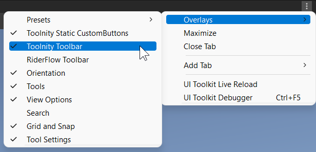
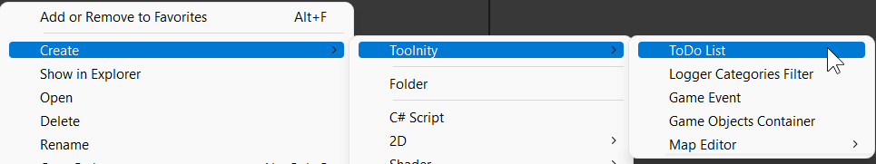

# Toolnity

## Information
**Toolnity** is a bunch of Editor Tools and Gameplay Utilities for Unity.

* You can find the most of the utilities in the Unity Menus:

* You can add the **Toolnity Toolbar** and **Toolnity Static CustomButtons Toolbar** in your Scene view using the overlays

--------------------------------

## How to install it?
The repository is ready to be used directly in Unity without the need to download it. 

* You can add it to your project using the git URL in the Package Manager.

* You can use also OpenUPM to link **Toolnity** by version (**recommended**).

 *The big part of the content is made from scratch, but some classes are from other authors or are inspired from other authors (in these cases, you will find the link inside the source)* 

--------------------------------

## Settings
You can enable and disable the most of the editor tools in your project settings:

 

Remember to check the Context Menu in your Project Window to create **Toolnity** objects:

## Packages

* [Autos](/Packages/Toolnity%20-%20Autos)
* [Collections](/Packages/Toolnity%20-%20Collections)
* [Custom Buttons](/Packages/Toolnity%20-%20Custom%20Buttons)
* [Editor Extensions](/Packages/Toolnity%20-%20Editor%20Extensions)
* [Favorites](/Packages/Toolnity%20-%20Favorites)
* [Game Events](/Packages/Toolnity%20-%20Game%20Events)
* [Games](/Packages/Toolnity%20-%20Games)
* [Hierarchy Window Extensions](/Packages/Toolnity%20-%20Hierarchy%20Window%20Extensions)
* [Lighting Utils](/Packages/Toolnity%20-%20Lighting%20Utils)
* [Logger](/Packages/Toolnity%20-%20Logger)
* [Map Generator](/Packages/Toolnity%20-%20Map%20Generator)
* [Project Info](/Packages/Toolnity%20-%20Project%20Info)
* [Runtime Scripts](/Packages/Toolnity%20-%20Runtime%20Scripts)
* [Scene Tools](/Packages/Toolnity%20-%20Scene%20Tools)
* [Shortcuts](/Packages/Toolnity%20-%20Shortcuts)
* [Storyboard Creator](/Packages/Toolnity%20-%20Storyboard%20Creator)
* [To Do List](/Packages/Toolnity%20-%20To%20Do%20List)

--------------------------------

## Support
This is an Open Source project that I'm developing in my spare time.
You can use it as you want or contact with me for any feedback, suggestion or just say Hi!

If you want to contribute, you can do it with Pull Requests or supporting me as a Sponsor in GitHub to keep working on that:
[https://github.com/sponsors/DTeruel](https://github.com/sponsors/DTeruel)

# Thank you!
